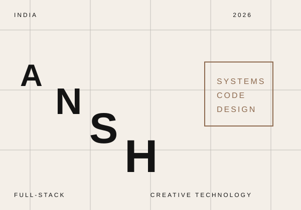
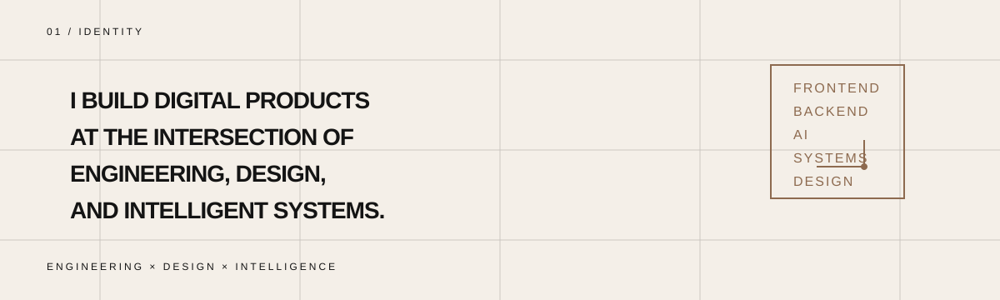
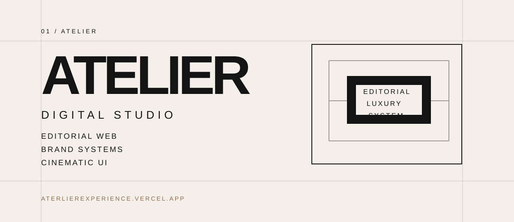
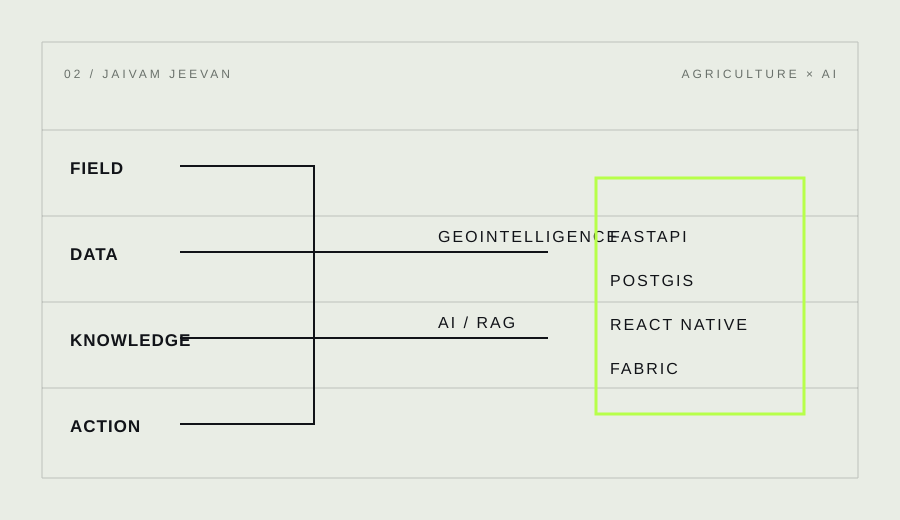
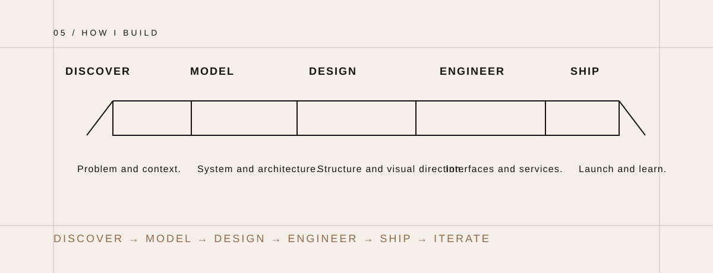
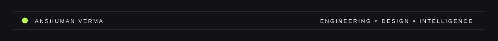

  

<table width="100%" cellpadding="0" cellspacing="0" style="margin-top: 24px; margin-bottom: 12px;">
  <tr>
    <td width="62%" valign="top" style="padding-right: 28px;">
      
<strong>01 / FIELD</strong>

      <h2 style="font-size: 42px; line-height: 0.92; letter-spacing: -2px; margin: 0 0 18px; font-weight: 700; color: #111111;">I BUILD DIGITAL SYSTEMS WHERE ENGINEERING MEETS VISUAL CULTURE.</h2>
      

        I work across interfaces, backend systems, intelligent applications and digital experiences — moving between engineering and design depending on what the product actually needs.
      

    </td>
    <td width="38%" valign="top">
      

        INDIA 
        FULL-STACK 
        CREATIVE TECHNOLOGY 
        2026 
        ENGINEERING × DESIGN × INTELLIGENCE
      

      
    </td>
  </tr>
</table>

  

<table width="100%" cellpadding="0" cellspacing="0">
  <tr>
    <td width="58%" valign="top" style="padding-right: 28px;">
      
<strong>02 / PRACTICE</strong>

      <h2 style="font-size: 78px; line-height: 0.78; letter-spacing: -5px; margin: 0 0 12px; font-weight: 700; color: #111111;">ATELIER</h2>
      

        DIGITAL STUDIO / EDITORIAL WEB / BRAND SYSTEMS / CINEMATIC UI
      

      

        ATELIER is a design practice focused on editorial experiences, luxury brand systems and technically precise interfaces. The work moves through architecture, typography and atmosphere — built for businesses that want clarity, a point of view and a digital presence that feels real.
      

      

        <a href="https://aterlierexperience.vercel.app">ATERLIEREXPERIENCE.VERCEL.APP</a>
      

    </td>
    <td width="42%" valign="top">
      
    </td>
  </tr>
</table>

<table width="100%" cellpadding="0" cellspacing="0">
  <tr>
    <td width="50%" valign="top" style="padding-right: 28px;">
      
<strong>03 / SYSTEM</strong>

      <h2 style="font-size: 50px; line-height: 0.9; letter-spacing: -3px; margin: 0 0 14px; font-weight: 700; color: #111111;">JAIVAM JEEVAN</h2>
      

        AGRICULTURE × AI × TECHNOLOGY
      

      

        A mobile-first system that turns agricultural knowledge into personalized, actionable guidance. It is designed around grounded advisory logic, geospatial awareness and product thinking that respects complexity rather than pretending a chat interface is enough.
      

      

        AI / AGRICULTURE / GEOINTELLIGENCE / BLOCKCHAIN / OFFLINE-FIRST SYSTEMS
      

    </td>
    <td width="50%" valign="top">
      
    </td>
  </tr>
</table>

FIELD → DATA → KNOWLEDGE → RAG → ADVISORY → ACTION

<strong>04 / BUILD</strong>

  

  OBSERVE: understand the real condition before proposing a solution. 
  MODEL: turn ambiguity into systems, flows and constraints. 
  DESIGN: shape the experience, signal and product language. 
  ENGINEER: build the technical core with discipline and clarity. 
  SHIP: release thoughtfully, without noise or overpromising. 
  ITERATE: refine through evidence, friction and use.

<table width="100%" cellpadding="0" cellspacing="0">
  <tr>
    <td width="52%" valign="top" style="padding-right: 16px;">
      
<strong>05 / STACK</strong>

      <table width="100%" cellpadding="8" cellspacing="0" style="border-collapse: collapse;">
        <tr>
          <td width="24%" valign="top" style="border-top: 1px solid #111111; padding-top: 10px; font-size: 12px; letter-spacing: 3px; text-transform: uppercase; color: #4b4b4b;">Languages</td>
          <td style="border-top: 1px solid #111111; padding-top: 10px; font-size: 16px;">Python / C++ / TypeScript / JavaScript</td>
        </tr>
        <tr>
          <td width="24%" valign="top" style="border-top: 1px solid #111111; padding-top: 10px; font-size: 12px; letter-spacing: 3px; text-transform: uppercase; color: #4b4b4b;">Interface</td>
          <td style="border-top: 1px solid #111111; padding-top: 10px; font-size: 16px;">React / Next.js / React Native</td>
        </tr>
        <tr>
          <td width="24%" valign="top" style="border-top: 1px solid #111111; padding-top: 10px; font-size: 12px; letter-spacing: 3px; text-transform: uppercase; color: #4b4b4b;">Backend</td>
          <td style="border-top: 1px solid #111111; padding-top: 10px; font-size: 16px;">FastAPI / Node.js</td>
        </tr>
        <tr>
          <td width="24%" valign="top" style="border-top: 1px solid #111111; padding-top: 10px; font-size: 12px; letter-spacing: 3px; text-transform: uppercase; color: #4b4b4b;">Data</td>
          <td style="border-top: 1px solid #111111; padding-top: 10px; font-size: 16px;">PostgreSQL / PostGIS</td>
        </tr>
        <tr>
          <td width="24%" valign="top" style="border-top: 1px solid #111111; padding-top: 10px; font-size: 12px; letter-spacing: 3px; text-transform: uppercase; color: #4b4b4b;">Infra</td>
          <td style="border-top: 1px solid #111111; padding-top: 10px; font-size: 16px;">Docker / Git / GitHub</td>
        </tr>
        <tr>
          <td width="24%" valign="top" style="border-top: 1px solid #111111; padding-top: 10px; font-size: 12px; letter-spacing: 3px; text-transform: uppercase; color: #4b4b4b;">Exploring</td>
          <td style="border-top: 1px solid #111111; padding-top: 10px; font-size: 16px;">Kubernetes / AI / RAG / System Design / Distributed Systems / Hyperledger Fabric</td>
        </tr>
      </table>
    </td>
    <td width="48%" valign="top" style="padding-left: 16px;">
      
<strong>06 / NOW</strong>

      
CURRENTLY EXPLORING

      

        Kubernetes 
        AI / RAG 
        System Design 
        Distributed Systems 
        Hyperledger Fabric
      

    </td>
  </tr>
</table>

<strong>07 / CONTACT</strong>

LET'S BUILD SOMETHING WORTH REMEMBERING.

<table width="100%" cellpadding="0" cellspacing="0">
  <tr>
    <td width="25%" valign="top" style="padding-right: 12px;">
      
GitHub

      
<a href="https://github.com/AnshumanVerma-goat">AnshumanVerma-goat</a>

    </td>
    <td width="25%" valign="top" style="padding-right: 12px;">
      
LinkedIn

      
<a href="https://www.linkedin.com/in/anshuman-verma-108791328">anshuman-verma</a>

    </td>
    <td width="25%" valign="top" style="padding-right: 12px;">
      
Email

      
<a href="mailto:anshumanverma027@gmail.com">anshumanverma027@gmail.com</a>

    </td>
    <td width="25%" valign="top">
      
ATELIER

      
<a href="https://aterlierexperience.vercel.app">aterlierexperience.vercel.app</a>

    </td>
  </tr>
</table>

  

  ANSHUMAN VERMA — FULL-STACK DEVELOPER / CREATIVE TECHNOLOGIST

  ENGINEERING × DESIGN × INTELLIGENCE

