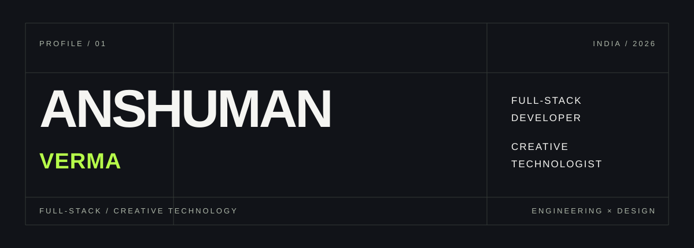

<p align="center">
  
</p>

<br>

<div align="center">

# ANSHUMAN VERMA

### FULL-STACK DEVELOPER · CREATIVE TECHNOLOGIST

Building digital products where **engineering, design and intelligent systems** meet.

<br>

[PORTFOLIO](https://aterlierexperience.vercel.app) &nbsp;·&nbsp;
[LINKEDIN](https://www.linkedin.com/in/anshuman-verma-108791328) &nbsp;·&nbsp;
[GITHUB](https://github.com/AnshumanVerma-goat) &nbsp;·&nbsp;
[EMAIL](mailto:anshumanverma027@gmail.com)

</div>

<br><br>

---

<br>

<table>
<tr>
<td width="55%" valign="top">

## 01 — PROFILE

I’m a full-stack developer and creative technologist focused on building **high-quality digital experiences**.

My work sits between:

**PRODUCT**  
Interfaces, platforms & applications

**ENGINEERING**  
Architecture, APIs & scalable systems

**DESIGN**  
Typography, interaction & visual direction

**AI**  
RAG systems, intelligent workflows & applied AI

</td>

<td width="45%" valign="top">

```text
BASED IN        INDIA

ROLE            FULL-STACK
                DEVELOPER

SPECIALTY       DIGITAL
                EXPERIENCES

CURRENTLY       BUILDING
                + LEARNING

STATUS          ONLINE
                / AVAILABLE
</td> </tr> </table>

<br><br>

SELECTED WORK
<br>
02 / ATELIER
A DIGITAL STUDIO FOR BRANDS THAT CARE ABOUT DETAIL.

ATELIER is my creative studio focused on premium websites,
editorial interfaces, branding and cinematic digital experiences.

Design-led.
Minimal.
Deliberate.

SERVICES

WEB DESIGN · UI/UX · BRANDING · FULL-STACK DEVELOPMENT

<br>

VISIT →
https://aterlierexperience.vercel.app

<br><br>

<br>
03 / JAIVAM JEEVAN
AGRICULTURE × AI × TECHNOLOGY

A mobile-first platform designed to transform agricultural
knowledge into personalized, actionable experiences.

REACT NATIVE
      ↓
FASTAPI
      ↓
POSTGRESQL + POSTGIS
      ↓
AI / RAG
      ↓
HYPERLEDGER FABRIC

The system explores how AI, location intelligence,
blockchain and agricultural science can work together
inside a single product.

<br>

FOCUS

AI ADVISORY
FARMER PASSPORT
GEO-SPATIAL DATA
OFFLINE-FIRST UX

<br><br>

<br>
THE STACK
04 / TOOLS OF PRACTICE

I don't collect technologies.

I use them to build things.

<br>
LANGUAGES

Python C++ TypeScript JavaScript

FRONTEND

React Next.js React Native

BACKEND

FastAPI Node.js

DATA

PostgreSQL PostGIS

INFRASTRUCTURE

Docker Git GitHub

EXPLORING

Kubernetes RAG System Design Distributed Systems
Hyperledger Fabric

<br><br>

<br>
HOW I BUILD
05 / THE SYSTEM
        ┌───────────────────────┐
        │       DISCOVER        │
        │                       │
        │  problem / context    │
        └───────────┬───────────┘
                    ↓
        ┌───────────────────────┐
        │        DESIGN         │
        │                       │
        │  structure / visual   │
        └───────────┬───────────┘
                    ↓
        ┌───────────────────────┐
        │       ENGINEER        │
        │                       │
        │  frontend / backend   │
        └───────────┬───────────┘
                    ↓
        ┌───────────────────────┐
        │        SHIP           │
        │                       │
        │  deploy / measure     │
        └───────────────────────┘
<br>
PRINCIPLES

01 — Make it useful.
02 — Make it beautiful.
03 — Make it fast.
04 — Make it understandable.
05 — Then make it scale.

<br><br>

<br>
CURRENTLY
06 / NOW
LEARNING
────────────────────────────────────────

C++ / DSA
SYSTEM DESIGN
KUBERNETES
DISTRIBUTED SYSTEMS
AI / RAG ARCHITECTURES


BUILDING
────────────────────────────────────────

ATELIER
FULL-STACK PRODUCTS
AI-POWERED SYSTEMS
DIGITAL EXPERIENCES


INTERESTED IN
────────────────────────────────────────

CREATIVE TECHNOLOGY
PRODUCT ENGINEERING
GENERATIVE AI
SPATIAL / GEO DATA
DECENTRALIZED SYSTEMS

<br><br>

<br>
THE LAB
07 / THINGS I'M EXPLORING
<table> <tr> <td width="33%" valign="top">
AI SYSTEMS

RAG architectures
AI advisory engines
Knowledge systems
Context retrieval

</td> <td width="33%" valign="top">
INFRASTRUCTURE

Docker
Kubernetes
Distributed systems
Scalable APIs

</td> <td width="33%" valign="top">
DIGITAL

Creative development
Motion
Editorial UI
Interaction design

</td> </tr> </table>

<br><br>

<br>
CONTACT
08 / LET'S BUILD SOMETHING.

If you're building a product, brand or idea
that deserves more than a template —

let's talk.

<br>
EMAIL

anshumanverma027@gmail.com

LINKEDIN

linkedin.com/in/anshuman-verma-108791328

ATELIER

aterlierexperience.vercel.app

PHONE

+91 78690 55374

<br><br>

<br> <div align="center">
ANSHUMAN VERMA
FULL-STACK DEVELOPER / CREATIVE TECHNOLOGIST

DESIGN × ENGINEERING × INTELLIGENCE
<br>

BUILDING THINGS WORTH REMEMBERING.

<br><br>

↑ BACK TO TOP

</div>