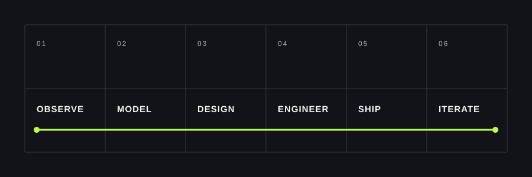

  

<table width="100%" cellpadding="0" cellspacing="0">
  <tr>
    <td width="55%" valign="top" style="padding: 24px 28px 24px 0;">
      
<strong>01 / INTRODUCTION</strong>

      <h2 style="margin: 0; font-size: 38px; line-height: 1.02; color: #111318;">BUILDING DIGITAL PRODUCTS AT THE EDGE OF ENGINEERING AND DESIGN.</h2>
    </td>
    <td width="45%" valign="top" style="padding: 24px 0;">
      
I work across frontend engineering, backend systems, AI-powered applications and digital experiences. The goal is simple: make complex ideas feel clear, useful and considered.

      
INDIA / FULL-STACK / CREATIVE TECHNOLOGY

    </td>
  </tr>
</table>

<strong>02 / SELECTED WORK</strong>

<table width="100%" cellpadding="0" cellspacing="0">
  <tr>
    <td width="56%" valign="top" style="padding: 0 28px 24px 0;">
      
    </td>
    <td width="44%" valign="top" style="padding: 4px 0 24px;">
      
01 / DIGITAL STUDIO

      <h2 style="margin: 0 0 10px; font-size: 30px; line-height: 1; color: #111318;">ATELIER</h2>
      
Editorial web / brand systems / cinematic UI

      
A design practice for editorial experiences, luxury brand systems and technically precise interfaces.

      
<strong>STACK</strong> Next.js / React / TypeScript / UI/UX

      
<a href="https://aterlierexperience.vercel.app"><strong>VISIT ATELIER ↗</strong></a>

    </td>
  </tr>
</table>

<table width="100%" cellpadding="0" cellspacing="0">
  <tr>
    <td width="44%" valign="top" style="padding: 4px 28px 24px 0;">
      
02 / AGRICULTURE × AI

      <h2 style="margin: 0 0 10px; font-size: 30px; line-height: 1; color: #111318;">JAIVAM JEEVAN</h2>
      
AI / geospatial systems / blockchain

      
A mobile-first agricultural technology platform combining grounded AI/RAG, geospatial systems and blockchain.

      
<strong>STACK</strong> React Native / FastAPI / PostgreSQL / PostGIS / Hyperledger Fabric

    </td>
    <td width="56%" valign="top" style="padding: 0 0 24px;">
      
    </td>
  </tr>
</table>

<table width="100%" cellpadding="0" cellspacing="0">
  <tr>
    <td width="52%" valign="top" style="padding: 0 28px 24px 0;">
      
<strong>03 / HOW I WORK</strong>

      
    </td>
    <td width="48%" valign="top" style="padding: 4px 0 24px;">
      
PRACTICE

      
Observe the real condition. Model the system. Design the signal. Engineer the core. Ship thoughtfully. Iterate with evidence.

      
BUILD / SHIP / ITERATE ENGINEERING × DESIGN × INTELLIGENCE

    </td>
  </tr>
</table>

<strong>04 / TECHNICAL INDEX</strong>

<table width="100%" cellpadding="8" cellspacing="0" style="border-collapse: collapse;">
  <tr><td width="22%" valign="top" style="border-top: 1px solid #c9cec7; font-size: 12px; letter-spacing: 2px; text-transform: uppercase; color: #69706a;">01 / Languages</td><td style="border-top: 1px solid #c9cec7; font-size: 16px; color: #111318;">Python / C++ / TypeScript / JavaScript</td></tr>
  <tr><td valign="top" style="border-top: 1px solid #c9cec7; font-size: 12px; letter-spacing: 2px; text-transform: uppercase; color: #69706a;">02 / Frontend</td><td style="border-top: 1px solid #c9cec7; font-size: 16px; color: #111318;">React / Next.js / React Native</td></tr>
  <tr><td valign="top" style="border-top: 1px solid #c9cec7; font-size: 12px; letter-spacing: 2px; text-transform: uppercase; color: #69706a;">03 / Backend</td><td style="border-top: 1px solid #c9cec7; font-size: 16px; color: #111318;">FastAPI / Node.js</td></tr>
  <tr><td valign="top" style="border-top: 1px solid #c9cec7; font-size: 12px; letter-spacing: 2px; text-transform: uppercase; color: #69706a;">04 / Data</td><td style="border-top: 1px solid #c9cec7; font-size: 16px; color: #111318;">PostgreSQL / PostGIS</td></tr>
  <tr><td valign="top" style="border-top: 1px solid #c9cec7; font-size: 12px; letter-spacing: 2px; text-transform: uppercase; color: #69706a;">05 / Infrastructure</td><td style="border-top: 1px solid #c9cec7; font-size: 16px; color: #111318;">Docker / Git / GitHub</td></tr>
  <tr><td valign="top" style="border-top: 1px solid #c9cec7; font-size: 12px; letter-spacing: 2px; text-transform: uppercase; color: #69706a;">06 / Exploring</td><td style="border-top: 1px solid #c9cec7; font-size: 16px; color: #111318;">Kubernetes / AI / RAG / System Design / Distributed Systems / Hyperledger Fabric</td></tr>
</table>

<table width="100%" cellpadding="0" cellspacing="0">
  <tr>
    <td width="58%" valign="top" style="padding: 0 28px 24px 0;">
      
<strong>05 / CURRENTLY BUILDING</strong>

      
AI / RAG SYSTEMS BACKEND ARCHITECTURE CREATIVE DIGITAL EXPERIENCES

    </td>
    <td width="42%" valign="top" style="padding: 4px 0 24px;">
      
01 — Kubernetes 02 — System design 03 — Distributed systems 04 — Hyperledger Fabric

    </td>
  </tr>
</table>

<strong>06 / CONTACT</strong>

<h2 style="margin: 0 0 18px; font-size: 36px; line-height: 1.05; color: #111318;">LET'S BUILD SOMETHING WORTH SHIPPING.</h2>
<table width="100%" cellpadding="0" cellspacing="0">
  <tr>
    <td width="25%" valign="top">
Email

<a href="mailto:anshumanverma027@gmail.com">anshumanverma027@gmail.com</a>
</td>
    <td width="25%" valign="top">
LinkedIn

<a href="https://www.linkedin.com/in/anshuman-verma-108791328">anshuman-verma</a>
</td>
    <td width="25%" valign="top">
GitHub

<a href="https://github.com/AnshumanVerma-goat">AnshumanVerma-goat</a>
</td>
    <td width="25%" valign="top">
Phone

+91 78690 55374
</td>
  </tr>
</table>

